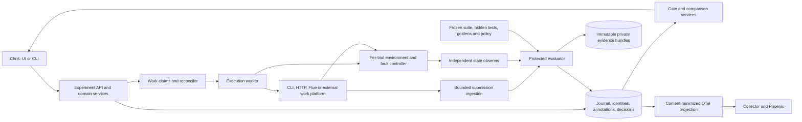
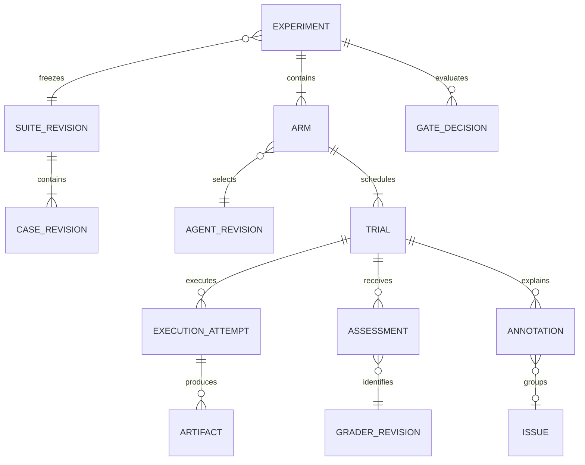
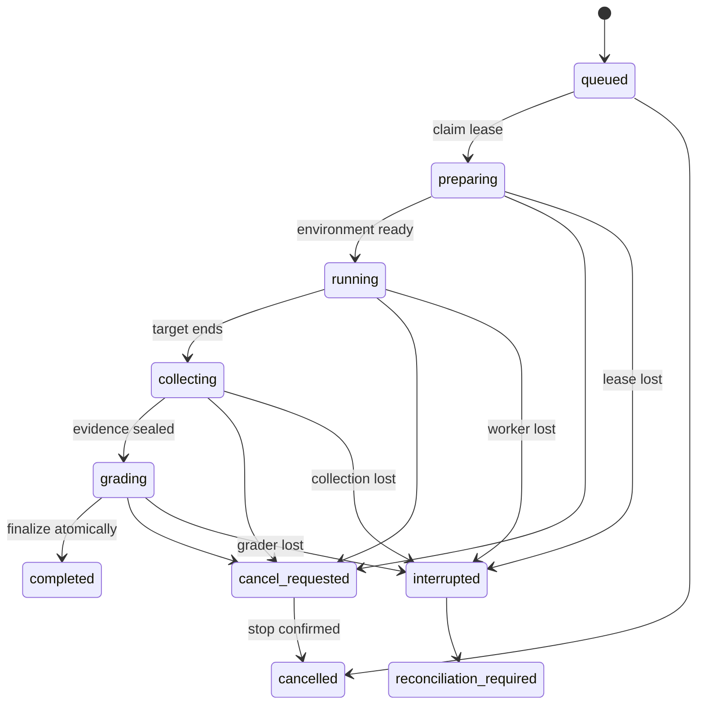

# Proposed architecture and contracts

September 11, 2026. Everything in this document is proposed unless explicitly identified as existing. The architecture extends the code paths in [current state](current-state.md); it does not replace the target agents' runtimes.

## Components and authority



The agent can access task inputs, its workspace and permitted tools. It cannot read the evaluator's hidden volume, goldens, acceptance policy, state-observer credentials or result writer. Evaluator subprocesses do not import submitted code into their own authority. Existing `isolated-black-box` coding execution remains the strongest implemented boundary; local same-user CLI mode is explicitly cooperative.

Task instructions must express the required behavior even when exact tests and answers are hidden. Public fixture cases are development/regression material, not a secret benchmark. A held-out pack lives outside the target checkout and public repository, has separately controlled access, and returns limited diagnostics. Source access by an agent to this public repository means its published goldens cannot credibly be called unseen.

Untrusted output, patches, trace arguments and imported state are data. Artifact ingestion rejects traversal, symlinks, oversized archives, unsupported schemas and unapproved outbound artifact locations. The service reads only registered local paths or approved object-store keys; it is not a general URL fetcher. The UI renders text safely and never executes target HTML. Arbitrary grader code is installed by the evaluator owner, not uploaded through a target submission.

## Domain model



| Record | Required identity and semantics |
|---|---|
| `SuiteRevision` / `CaseRevision` | Immutable content digests, schema version, split (`development`, `regression`, `capability`, `held_out`), origin, license, reviewed status, task-family grouping and exposure history. Changes produce new revisions. |
| `AgentRevision` | Adapter name/version, source revision plus dirty-tree digest if applicable, executable/container digest, prompt/config digests, model requested/resolved identity, runtime/dependency identity and retry policy. Each field has provenance (`observed`, `operator_asserted`, `unknown`). Private model/endpoint data stays private. A command hash does not stand in for these fields. |
| `Experiment` / `Arm` | Frozen suite, baseline/candidate IDs, ordered trial plan, seed, execution profile, grader/policy revisions, stopping rule and budget; registration timestamp. Edits after launch create a new experiment. |
| `Trial` | Unique `(experiment, arm, case_revision, replicate)`; fresh environment/session identity and fault schedule digest. One planned measurement, not one model call. |
| `ExecutionAttempt` | Attempt ID, trial ID, attempt kind (`initial`, `infra_recovery`, `assisted_correction`), parent ID, worker lease epoch, start/end times, execution status, adapter receipt, resource/usage observations. Model transport retries and format corrections are nested events where visible. Unknown inner retries remain unknown. |
| `Assessment` | Reuse existing normalized assessment concepts: dimension, grader identity, threshold/direction, value, status, evidence artifact digest, source kind and reason reference. Regrading adds an assessment set; it never overwrites an old one. |
| `Artifact` | Content hash, byte count, media/schema type, logical role, producer, access classification, retention class and storage key. Bundles bind input, environment, candidate, observations, grader outputs and manifests. Raw and redacted versions are separate objects. |
| `Annotation` / `Issue` | Human/model origin, author, timestamp, taxonomy version, evidence pointer, confidence and revision. Issues group suspected patterns; a proposed cause is distinguishable from a verified cause. Edits append history. |
| `GateDecision` | Exact cohort and assessment-set digest, policy revision, pass/fail/inconclusive, reasons, missingness, evaluator identity and creation time. Re-evaluation creates a new decision; deployment authority remains external. |

Use a new versioned experiment envelope. Do not mutate strict black-box suite `1.0` or report `1.0`/`1.1` fields in place. Store references to legacy records and their hashes. Existing `passed`, `overall_passed`, scores and exit codes retain their meanings in legacy commands/exports. Derivative inspection reports must not count as new agent trials.

## Lifecycle and failure semantics



Execution state is separate from evaluation outcome. `completed` can have accepted or rejected quality. Cancelled/interrupted work is not a clean rejection or silently absent row. New structured failure fields are `phase`, `origin`, `reason`, `retryability`, `fault_expected`, and `evidence_status`. Preserve raw legacy outcome alongside any new classification.

| Event | New semantics | Cohort effect |
|---|---|---|
| Valid output violates a requirement | Agent/task quality failure | Rejected first-attempt measurement |
| Malformed final JSON under a required output contract | Agent contract failure if the boundary response is trustworthy; otherwise transport unknown | No pass. Legacy black-box export still uses its existing `infra_error` mapping |
| Injected tool timeout, agent safely reports unavailable | Score declared fault-task behavior, including correct refusal and bounded retries | May pass the fault suite; not silently mixed with fault-free quality |
| Control-plane timeout, unavailable grader, lost state snapshot | Evaluator/infrastructure evidence unavailable | Blocks a strict gate; do not call the agent incorrect without evidence |
| Target exceeds a declared task resource limit | Resource-contract failure when enforcement is verified | Rejected under that resource profile |
| Node pressure, eviction or unknown OOM cause | Infrastructure or unknown origin | Retain failure and provenance; no post-hoc reassignment to improve a score |
| User cancellation | Cancelled, reason recorded | Report planned/started/completed counts; inconclusive gate |

**Retry rules:** a transport retry inside the target is part of the agent system under test. A platform infrastructure rerun creates a new execution attempt and does not erase the interrupted one. A critique-guided correction is a separate assisted measurement. Held-out evaluation sends no grader critique to the agent. A first harness invocation of Flue may already include internal transport retries and format correction; call it first-invocation performance, not single-model-call accuracy, unless instrumentation proves the latter.

**Crash recovery:** persist the planned trial and claim before starting work. Use a monotonically increasing lease epoch and conditional writes. Late output from an expired worker may be retained for diagnosis but cannot finalize the trial. Store artifacts by digest, then transactionally link the immutable completion manifest, assessment and outbox event. A crash between object write and transaction leaves an unreferenced object for later cleanup; a crash after commit is idempotently recoverable. Rebuild query indexes from manifests rather than trusting partially written legacy directories.

Exactly-once remote execution is not promised. After dispatch without a durable receipt, reconcile by execution ID. If the target cannot report whether it ran and may have side effects, mark `reconciliation_required`; do not auto-retry. For disposable resettable worlds, a rerun may begin in a fresh environment as an explicitly linked recovery attempt. A finished observation awaiting grading can be regraded without invoking the target again.

**Cancellation:** immediately stop new claims, persist cancellation intent, request adapter cancellation, then terminate the owned process group or Job after a grace period. Never identify processes just by a reused PID. Remote HTTP disconnect alone is not cancellation confirmation. Keep status pending until acknowledged, deadline reached, or reconciliation records an unknown outcome. Retain budget reservations for unconfirmed billable work until settled or conservatively accounted. Cleanup tracks its own status and never deletes unrelated cluster resources.

## API and adapter contracts

The service uses typed JSON and shared Python domain services. These are proposed endpoints, not current APIs:

| API | Semantics |
|---|---|
| `POST /v1/experiments` | Validate registered target/suite/profile IDs and frozen plan; idempotency key plus body digest. Same key/body returns the same resource; changed body returns 409. No target side effects during validation. |
| `POST /v1/experiments/{id}/start` | Admit and queue once. Return 202 plus durable experiment identity. |
| `GET /v1/experiments/{id}` | Planned/started/completed counts, states, version evidence, budget and artifact availability. |
| `GET /v1/experiments/{id}/events?after=cursor` | Ordered bounded events, usable through SSE; reconnect by cursor. Event loss does not affect canonical state. |
| `POST /v1/experiments/{id}/cancel` | Idempotent request; return pending or confirmed status, never imply that a remote process stopped from HTTP acceptance alone. |
| `GET /v1/comparisons?baseline=...&candidate=...` | Validate cohort compatibility and paired keys. Return refusals/missingness as data, not fabricated deltas. |
| `POST /v1/trials/{id}/annotations` | Revision-aware append with evidence references. Human labels do not overwrite deterministic assessments. |
| `POST /v1/submissions` | Authorized producer submits a bounded candidate manifest; trusted ingestion validates identity and artifacts before grading. |

A proposed `ExecutionAdapter` supports `capabilities()`, `prepare(public_input, environment_handle)`, `start(execution_id, deadline, budget)`, `status(receipt)`, `collect(receipt)` and `cancel(receipt)`. Capabilities declare reset, cancellation acknowledgement, status reconciliation, trace completeness and usage reporting. Wrap existing synchronous `Target.invoke` without requiring existing targets to implement everything. Unsupported operations are explicit, not simulated guarantees.

The agent-visible payload contains only public input and permitted tool/session handles. Private case ID, expected output, reference answer, hidden tests and policy stay in a harness-side mapping. Out-of-band observer correlation maps execution ID to case/trial. A separate `EnvironmentAdapter` implements `reset(seed)`, `health()`, `snapshot(observer_capability)`, `apply_fault(schedule)` and `cleanup()`. An independent observer signs or authenticates its receipt in hosted mode; a target-supplied snapshot is marked untrusted.

### Companion work-platform submission

Proposed integration `agent-eval.submission/v1`:

```json
{
  "schema_version": "agent-eval.submission/v1",
  "execution_id": "opaque-harness-issued-id",
  "producer_run_id": "work-platform-run-id",
  "base_revision": "git-commit-id",
  "candidate_revision": "git-commit-id",
  "candidate_tree_sha256": "hex-content-digest",
  "recipe_sha256": "hex-content-digest",
  "artifacts": [{"role": "patch", "sha256": "hex-content-digest", "storage_key": "approved-key"}],
  "trace_reference": null,
  "usage": {"total_tokens": null, "cost_usd": null},
  "producer_status": "completed"
}
```

Illustrative values above are placeholders. The real schema validates exact digest formats and bounds. The evaluator binds this submission to its pre-issued trial, checks base/candidate compatibility, reconstructs the candidate from approved immutable sources, and runs independent tests. Producer completion, self-tests and review comments are evidence, never acceptance. Hashes detect changes; authenticated producer identity and controlled ingestion establish origin.

Return `agent-eval.decision/v1` with submission digest, assessment-set digest, policy digest, evaluator revision and pass/fail/inconclusive. The work platform must verify those identities before using a decision. It owns implementation, workspaces, model orchestration, PR creation and deployment. This platform owns experimental cases, trusted graders, acceptance and comparative reporting. It never gains GitHub publication permission through this integration. A contract fixture must prove stale candidates, replayed receipts and modified artifacts cannot receive a current decision.

### Concrete target integrations

**Flue:** wrap the existing raw-diff stdin/stdout CLI, never the watcher or publishing command. Its valid blocked verdict still exits zero; inspect `blocked`, input digest and normalized findings. Preserve specialized finding matching. Register Flue revision, prompt/config and runtime versions, plus internal retry policy. Unknown usage remains null because provider cost placeholders are not measurements. Obtain a new Flue baseline under explicit later run authorization.

**Order-status agent:** a wrapper maps public question/customer fixture to the existing agent request and final structured response. Run against a frozen fake ERP and a fresh request-scoped fault configuration. Independently assert correct order, grounded shipping data, ambiguous-customer refusal, cross-customer non-disclosure and no write side effects. Use scripted planning first for harness controls; later run real model planning under a budget. State observation verifies allowed reads and unchanged database state; the lab's own evaluator can be comparison evidence but is not the authority here.

**State-changing fixture:** add a disposable ticket world with allowed status changes and immutable owner fields. A known-bad agent says it updated a ticket without changing storage; another changes the wrong ticket. Hidden state predicates must catch both. This demonstrates state grading beyond read-only retrieval without requiring a second production application.

## UI, faults and telemetry

The UI has four core views: experiment list/launch, case-by-case baseline comparison, trial evidence, and annotation/issue queue. Launch shows agent version certainty, suite split, number of invocations, judging disclosure, isolation profile and budget before work starts. Trial detail separates first invocation, recovery, correction, model calls where visible, state differences and grading. Missing evidence uses an explicit unavailable label rather than zero latency or an empty successful trace.

Filter by failure origin, category, case family and arm. Start with taxonomy: retrieval miss, wrong entity, ungrounded claim, wrong tool/arguments, policy violation, incomplete side effect, format failure, resource exhaustion, environment failure, grader failure, unknown. Model-proposed categories remain suggestions. Labels reference a span, state delta or assessment. Root-cause claims need a reproducer or causal intervention; correlation alone is a hypothesis.

Faults live at the controlled tool/environment boundary: timeout before execution, 429 with retry information, malformed response, stale read, and ambiguous timeout after a write. Schedules are seeded and bound to logical operation/ordinal, not fragile wall-clock timing. Record requested and observed injection; an uninjected scheduled fault is invalid evidence. Separate input perturbation, transport fault and infrastructure contention experiments. Never inject faults into the existing production watcher or real external accounts.

Use existing content-minimized OTel export and trace links. Completeness-critical traces are captured locally without sampling by a trusted observer. Operational traces may be sampled and are labeled unsuitable for negative tool assertions. Content export requires deliberate configuration and retention; collector outage cannot change a quality score. Do not rebuild Phoenix's span explorer.

## Deployment and budgets

| Mode | Scope and storage | Limits and upgrade trigger |
|---|---|---|
| Local | Loopback API, single worker, SQLite journal, private files; optional Phoenix | Cooperative CLI or separately isolated containers. Local session token, origin/CSRF checks for mutations, no arbitrary path/command execution from an unauthenticated web page. Laptop sleep pauses scheduling and may invalidate deadlines. |
| k3s | Existing execution boundary plus Job controller/reconciler; PostgreSQL for shared workers, volume/object storage | Default one experimental worker so nightly evaluation and watcher are not resource-starved. Dedicated experiment namespace/quotas; no automatic migration of current schedules. Verify requests/limits, arm64/amd64 image identity, network enforcement and sleep/crash recovery. |
| Hosted team | Authenticated API, PostgreSQL, encrypted object storage, dedicated hardened workers | OIDC, project roles, separate worker credentials, tenant-scoped keys/queries/queues, egress controls and sandbox boundary. Promote only after adversarial isolation, restore and cancellation tests pass. |

Every profile specifies CPU request/limit, RAM request/limit, wall time, tool calls, output bytes, disk quota, concurrent jobs and provider spend policy. Local workers reserve capacity before dispatch. Distributed workers reserve budget transactionally across agent and judge work, debit observed usage, and retain an uncertainty allowance after missing usage or ambiguous cancellation. No provider-enforced spend bound means the UI labels the dollar cap advisory; token guesses are never actual usage. Hard execution limits and post-run observed thresholds stay distinct.

Team retention proposal: configurable raw-artifact expiry, longer content-minimized manifests, legal-hold support only when implemented, and deletion events with actor/reason. Default durations are product choices to establish with real data needs, not compliance claims. Test deletion across replicas/backups and explain recovery windows. Tenant separation must cover APIs, object access, trace export, caches, worker logs and support access, not only a `tenant_id` column.
